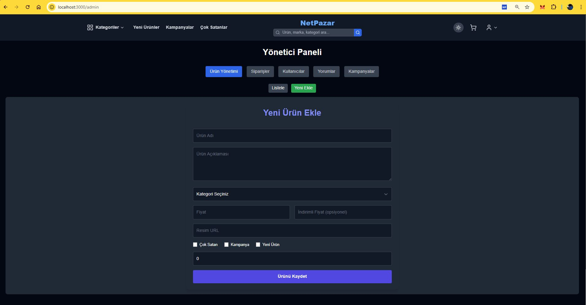
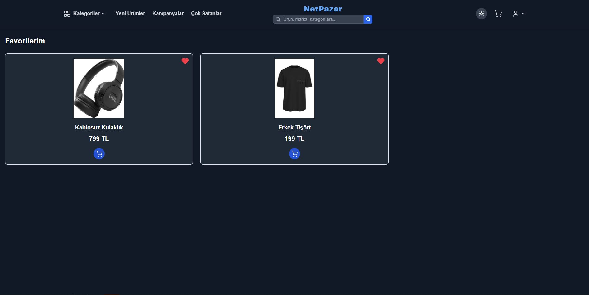
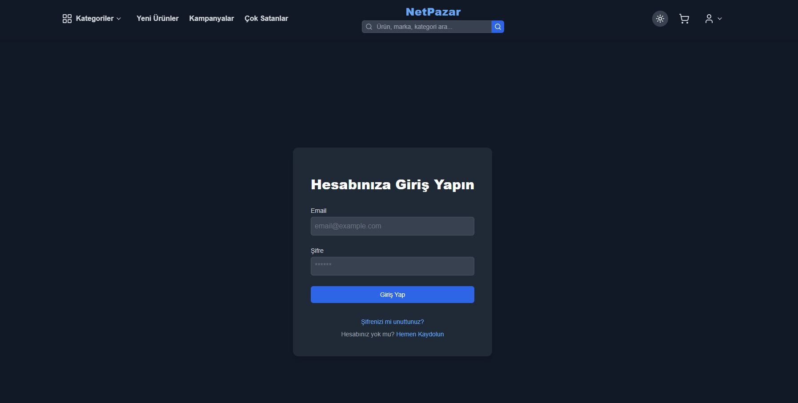
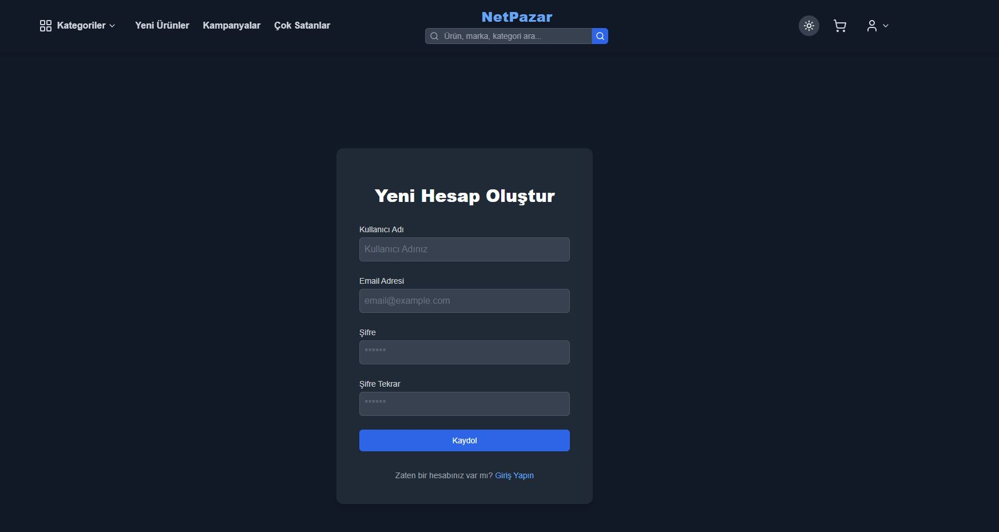
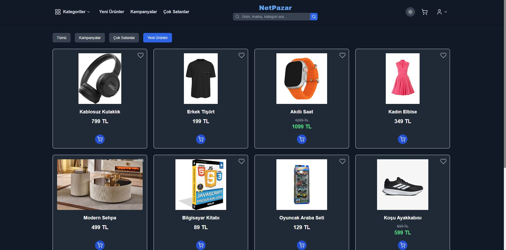
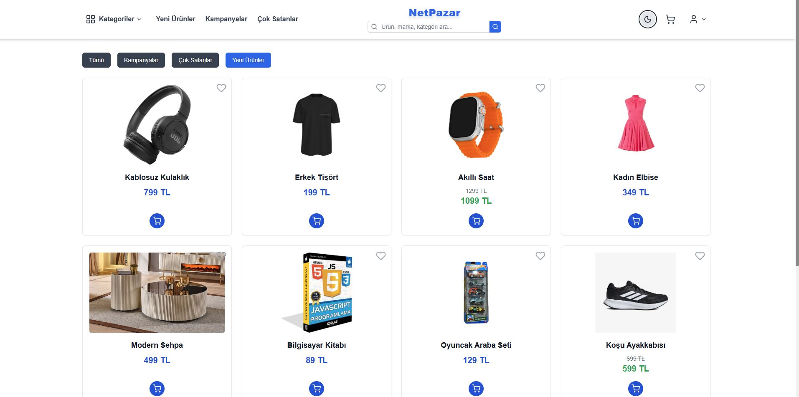
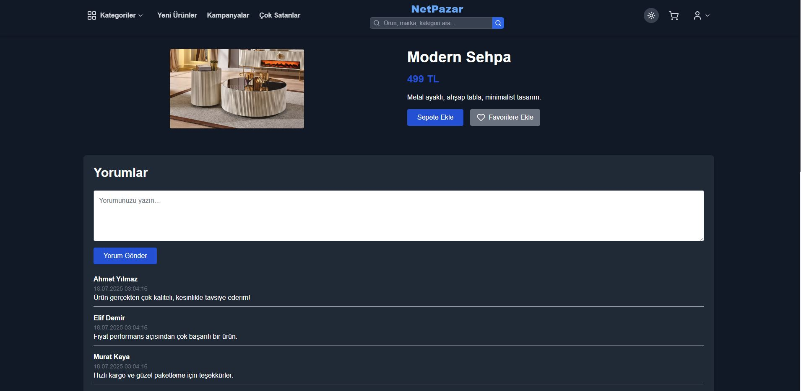
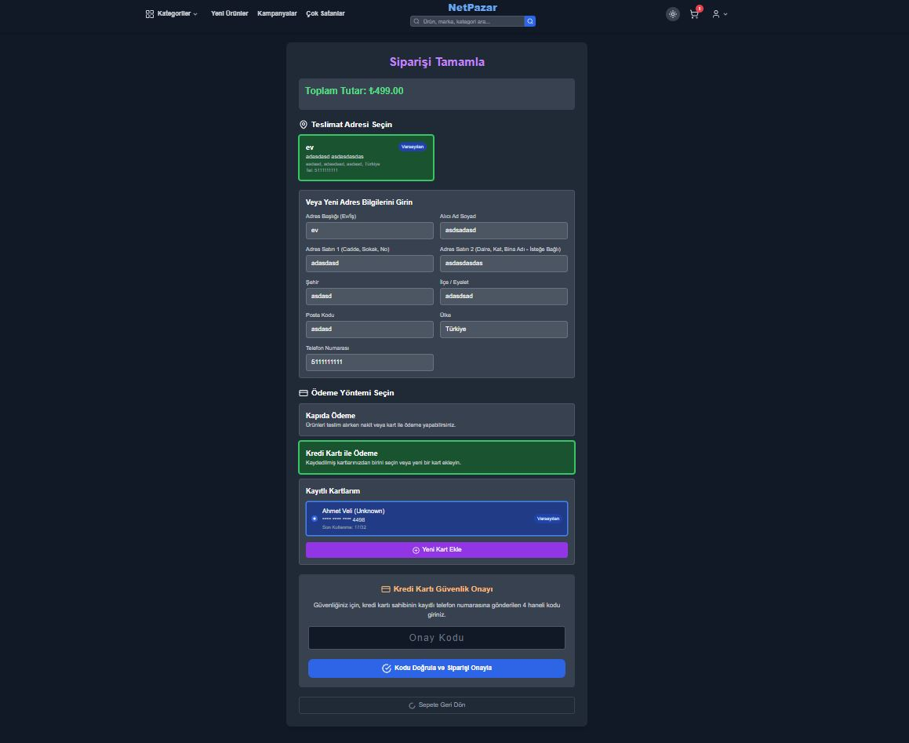
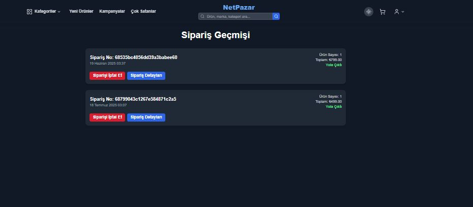

# NetPazar

NetPazar, Django ve React kullanılarak geliştirilmiş modern bir e-ticaret platformudur. Kullanıcılar ürünleri inceleyebilir, sepete ekleyip satın alabilir; satıcılar ise ürün ve siparişleri yönetebilir.

## 🚀 Özellikler

- Ürün listeleme ve detay sayfası
- Kullanıcı kayıt ve giriş sistemi
- Sepet ve sipariş işlemleri
- Admin paneliyle ürün, kategori ve sipariş yönetimi
- Sipariş durumu takibi (Beklemede → Kargoya verildi → Teslim edildi)
- Adres ve kayıtlı kart yönetimi
- Favoriler, yorumlar, kategori filtreleme
- Responsive tasarım

## 🛠️ Kullanılan Teknolojiler

**Frontend:** React, Redux Toolkit, Tailwind CSS  
**Backend:** Django, Django REST Framework, PostgreSQL

## 📷 Ekran Görüntüleri

## Admin Paneli


## Favoriler Sayfası


## Giriş Sayfası


## Kayıt Sayfası


## Ürünler Sayfası


## Beyaz Tema


## Ürün Detay Sayfası


## Ödeme Sayfası


## Kargo Takip Sayfası



## 🔧 Kurulum

### Backend:
```bash
cd backend
python -m venv venv
venv\Scripts\activate
pip install -r requirements.txt
python manage.py migrate
python manage.py runserver

### Frontend:
cd frontend
npm install
npm run dev

Geliştirici
efftta